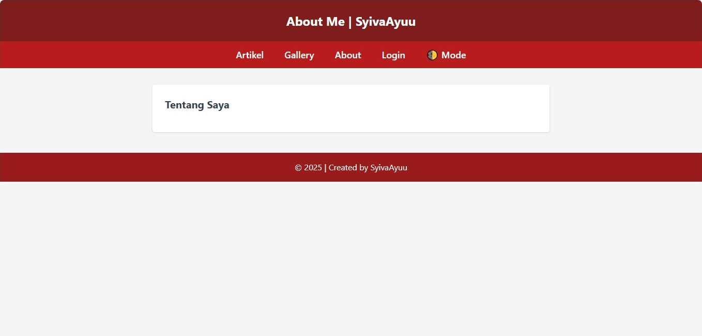
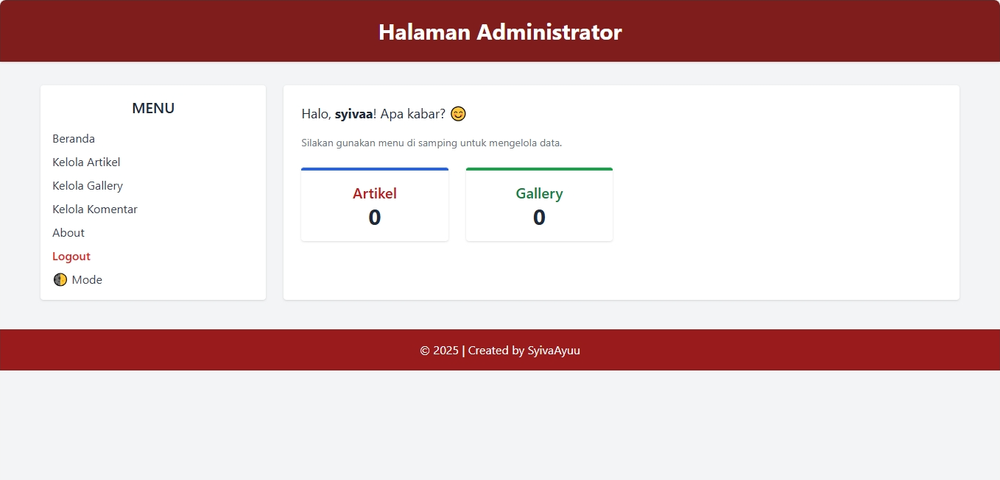
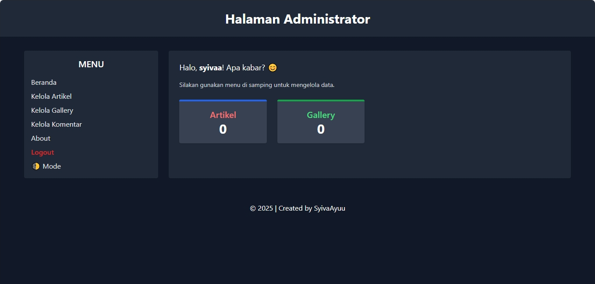
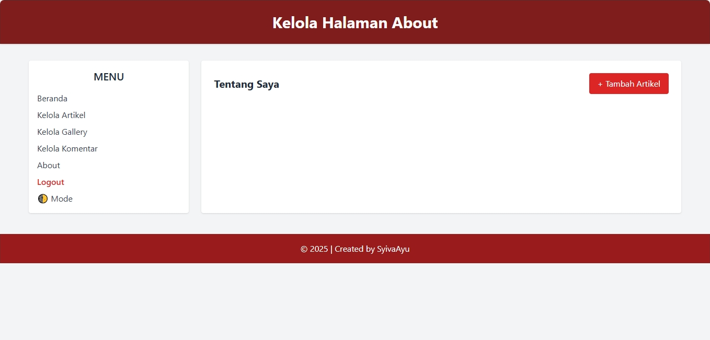
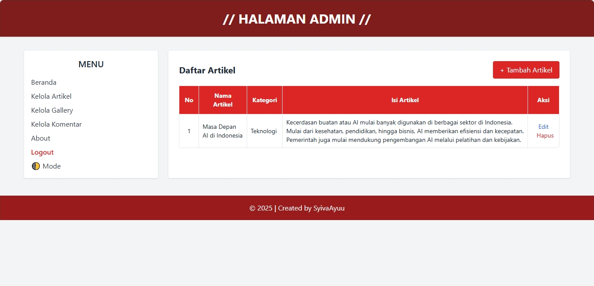
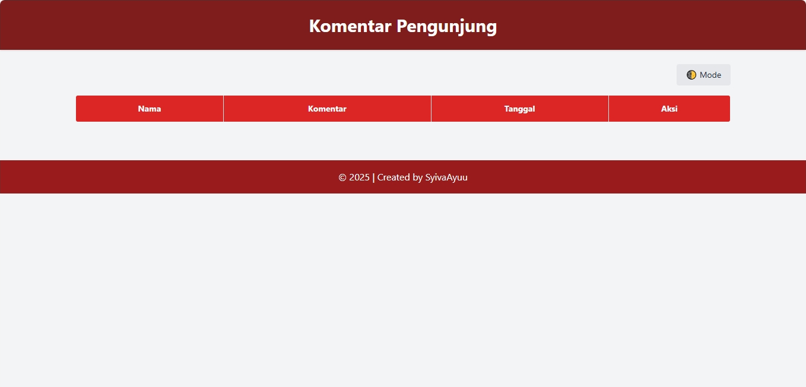
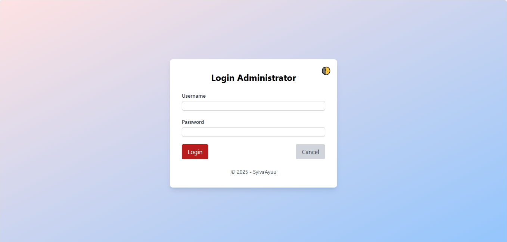
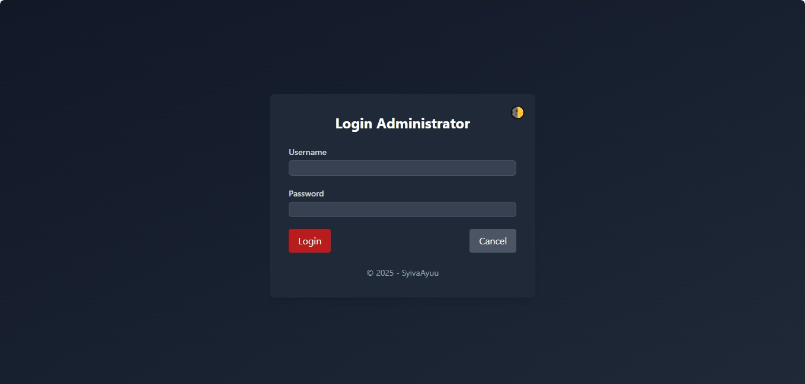

# 🌐 Web Personal Sederhana - Studi Kasus II

Ini adalah aplikasi web personal berbasis **PHP**, **MySQL**, dan **Tailwind CSS**, yang dikembangkan sebagai bagian dari tugas Studi Kasus II. Aplikasi ini memiliki halaman publik dan halaman admin yang bisa digunakan untuk mengelola artikel, galeri, dan profil pribadi.

---


## ✨ Fitur-Fitur Aplikasi

- ✅ Login & Logout Admin
- ✅ Manajemen Artikel (tambah, edit, hapus)
- ✅ Kategori Artikel 🏷️
- ✅ Fitur Pencarian Artikel 🔍
- ✅ Fitur Pencarian Gallery 🔍
- ✅ Fitur Menambah komentar (yang ada di halaman Artikel)
- ✅ Fitur Mode Gelap (Dark Mode 🌙)
- ✅ Galeri foto (upload & tampil, edit, hapus)
- ✅ Halaman About (tentang saya)
- ✅ Dashboard Admin (statistik jumlah data)

---


## 📸 Screenshot Tampilan

### 🔹 Halaman About


### 🔹 Dashboard Admin


### 🔹 Halaman Admin (dengan DarkMode)


### 🔹 Halaman Artikel 


### 🔹 Halaman Gallery


### 🔹 Halaman Kelola About


### 🔹 Halaman Kelola Artikel


### 🔹 Halaman Kelola Gallery


### 🔹 Halaman Komentar


### 🔹 Halaman Login


### 🔹 Halaman Login (dengan DarkMode)


---

## ⚙️ Cara Menjalankan Aplikasi

1. Clone atau download repository ini.
2. Jalankan **XAMPP** lalu aktifkan **Apache dan MySQL**.
3. Import file `db_nama_npm.sql` ke **phpMyAdmin**.
4. Pindahkan folder ini ke `htdocs/` yang ada di Local Disk (C;) setelah itu pilih Xamp, htdocs, kemudian di sini baru pindahkan foldernya (seperti: `Personal_syiva julianti_D1A240011`).
5. Akses melalui browser, untuk melihat hasil:  localhost/personal_syiva ayu julianti_D1A240011/

---


## 📂 Struktur Folder Project

```
Personal_nama_npm
├── index.php
├── gallery.php 
├── about.php 
├── artikel.php 
├── koneksi.php 
├── simpan_komentar.php 
├── tailwind.config.js 
├── admin/ 
│ ├── about.php 
│ ├── add_about.php 
│ ├── add_artikel.php 
│ ├── add_gallery.php 
│ ├── beranda_admin.php 
│ ├── cek_login.php 
│ ├── data_artikel.php 
│ ├── data_gallery.php 
│ ├── delete_about.php 
│ ├── delete_artikel.php 
│ ├── delete_gallery.php 
│ ├── edit_about.php
│ ├── edit_artikel.php 
│ ├── edit_gallery.php 
│ ├── hapus_komentar.php 
│ ├── komentar.php
│ ├── login.php 
│ ├── logout.php 
│ ├── proses_add_about.php 
│ ├── proses_add_artikel.php 
│ ├── proses_add_gallery.php 
│ ├── proses_edit_about.php 
│ ├── proses_edit_artikel.php 
│ └── proses_edit_gallery.php 
├── images/ 
│ └── ... (isi folder images, jika ada gambar)
├── screenshots/ 
│ ├── halaman_About.png
│ ├── halaman_Administrator_DarkMode.png
│ ├── halaman_Administrator.png
│ ├── halaman_Artikel.png
│ ├── halaman_Gallery.png
│ ├── halaman_Kelola_About.png
│ ├── halaman_kelola_Artikel.png
│ ├── halaman_Kelola_Gallery.png
│ ├── halaman_Komentar.png
│ ├── halaman_Login DarkMode.png
│ ├── halaman_Login.png
└── README.md
```

---


## 🧑‍💻 Dibuat oleh
**Syiva Ayu Julianti**  
Universitas Subang – Prodi Sistem Informasi  
Tugas Studi Kasus II – Semester 2

---


